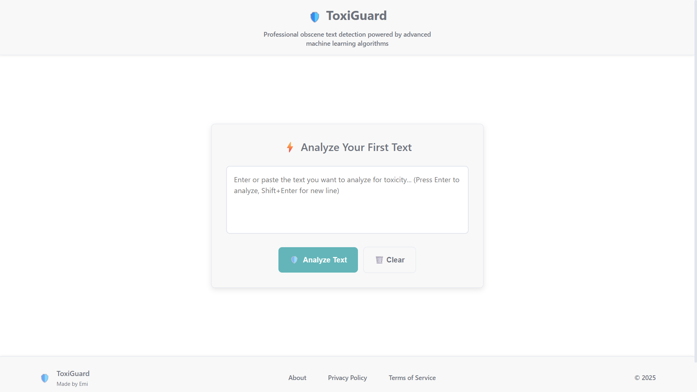

# 🛡️ ToxiGuard - Advanced Toxicity Detection System

A sophisticated web application that analyzes text content for toxicity using advanced Machine Learning techniques, providing real-time analysis with detailed insights and explanations.

## 📸 Project Screenshots

### Main Interface


_Clean, modern interface for text input and analysis_

### Analysis Results Dashboard


_Detailed toxicity analysis with real-time scoring and category breakdown_

## 🎯 Project Purpose

ToxiGuard is designed to help content moderators, educators, and researchers identify potentially harmful content in text. The system uses multiple ML classifiers and contextual analysis to provide accurate toxicity assessments with detailed explanations of the detection process.

### Key Features

- **Real-time Text Analysis**: Instant toxicity detection with highlighted keywords
- **Multi-Model ML System**: Ensemble of classifiers for improved accuracy
- **Contextual Analysis**: Understanding of negations and context
- **Detailed Explanations**: Clear breakdown of why content was flagged
- **Responsive Design**: Works seamlessly on desktop, tablet, and mobile
- **Professional UI/UX**: Clean, modern interface with consistent design system

## 🚀 Quick Start

### Prerequisites

- **Node.js** 18+ and **npm** 9+
- **Python** 3.8+ and **pip**
- **Git**

### One-Command Setup

```bash
# Clone and setup the entire project
git clone <repository-url> && cd toxiguard && npm run setup
```

### Manual Setup

```bash
# 1. Clone the repository
git clone <repository-url>
cd toxiguard

# 2. Install frontend dependencies
cd frontend
npm install

# 3. Install backend dependencies
cd ../backend
pip install -r requirements.txt

# 4. Start both services
npm run dev
```

### Running Locally

```bash
# Terminal 1: Start backend (FastAPI)
cd backend
uvicorn app.main:app --reload --host 0.0.0.0 --port 8000

# Terminal 2: Start frontend (React + Vite)
cd frontend
npm run dev
```

The application will be available at:

- **Frontend**: http://localhost:5173
- **Backend API**: http://localhost:8000
- **API Docs**: http://localhost:8000/docs

## 🛠️ Tech Stack

### Frontend

- **React 18** - Modern React with hooks and functional components
- **TypeScript** - Type-safe development
- **Vite** - Fast build tool and dev server
- **Tailwind CSS** - Utility-first CSS framework
- **Custom Design System** - Consistent UI components and styling

### Backend

- **FastAPI** - Modern, fast web framework for building APIs
- **Python 3.8+** - Core programming language
- **SQLite** - Lightweight database for analysis history
- **Uvicorn** - ASGI server for running FastAPI

### Machine Learning

- **Scikit-learn** - ML algorithms and utilities
- **Multiple Classifiers**: Naive Bayes, Random Forest, SVM, Logistic Regression
- **Hybrid Classification** - Combination of rule-based and ML approaches
- **Contextual Analysis** - Understanding of negations and context

### Development Tools

- **ESLint** - Code quality and consistency
- **Prettier** - Code formatting
- **TypeScript** - Static type checking
- **Git** - Version control

## 📁 Project Structure

```
toxiguard/
├── frontend/                 # React frontend application
│   ├── src/
│   │   ├── components/      # Reusable UI components
│   │   ├── hooks/          # Custom React hooks
│   │   ├── lib/            # Utility functions and API
│   │   ├── styles/         # Design system and styling
│   │   └── App.tsx         # Main application component
│   ├── package.json         # Frontend dependencies
│   └── vite.config.ts      # Vite configuration
├── backend/                 # FastAPI backend application
│   ├── app/
│   │   ├── main.py         # FastAPI application entry point
│   │   ├── models.py       # Data models and schemas
│   │   ├── services.py     # Business logic and ML services
│   │   └── database.py     # Database operations
│   ├── ml/                 # Machine learning modules
│   ├── models/             # Trained ML models
│   └── requirements.txt    # Python dependencies
├── data/                   # Training data and datasets
├── README.md              # This file
└── package.json           # Root package.json for scripts
```

## 🔧 Available Scripts

### Root Level (Project-wide)

```bash
npm run setup          # Setup entire project (frontend + backend)
npm run dev            # Start both frontend and backend
npm run build          # Build frontend for production
npm run clean          # Clean build artifacts and dependencies
npm run test           # Run all tests
npm run lint           # Lint all code
npm run format         # Format all code
```

### Frontend

```bash
npm run dev            # Start development server
npm run build          # Build for production
npm run preview        # Preview production build
npm run lint           # Lint TypeScript/React code
npm run type-check     # Check TypeScript types
```

### Backend

```bash
uvicorn app.main:app --reload    # Start development server
python -m pytest                 # Run tests
python -m black .                # Format Python code
python -m flake8                 # Lint Python code
```

## 🌐 API Endpoints

| Endpoint         | Method | Description                         |
| ---------------- | ------ | ----------------------------------- |
| `/`              | GET    | API information and status          |
| `/health`        | GET    | System health check                 |
| `/info`          | GET    | System information and capabilities |
| `/analyze`       | POST   | Analyze single text for toxicity    |
| `/batch-analyze` | POST   | Analyze multiple texts              |
| `/history`       | GET    | Get analysis history                |
| `/stats`         | GET    | Get system statistics               |
| `/docs`          | GET    | Interactive API documentation       |

## 🎨 Design System

The project includes a comprehensive design system with:

- **Typography Scale**: Consistent font sizes and weights
- **Color Palette**: Semantic colors for different states
- **Spacing System**: Standardized spacing values
- **Component Library**: Reusable UI components
- **Responsive Design**: Mobile-first approach with breakpoints

## 🧪 Testing

```bash
# Frontend tests
npm run test:frontend

# Backend tests
npm run test:backend

# All tests
npm run test
```

## 📦 Production Deployment

### Frontend

```bash
cd frontend
npm run build
# Serve the dist/ folder with your web server
```

### Backend

```bash
cd backend
pip install -r requirements.txt
uvicorn app.main:app --host 0.0.0.0 --port 8000
```

## 🤝 Contributing

1. Fork the repository
2. Create a feature branch (`git checkout -b feature/amazing-feature`)
3. Commit your changes (`git commit -m 'Add amazing feature'`)
4. Push to the branch (`git push origin feature/amazing-feature`)
5. Open a Pull Request

## 📄 License

This project is licensed under the MIT License - see the [LICENSE](LICENSE) file for details.

## 👥 Authors

- **Emi** - Initial work - [Emi](https://github.com/ehuerta6)

## 🙏 Acknowledgments

- Built with modern web technologies and best practices
- Uses advanced ML techniques for accurate toxicity detection
- Implements responsive design principles for all devices
- Follows accessibility guidelines for inclusive user experience

---

**ToxiGuard** - Protecting digital spaces with intelligent content analysis 🛡️
